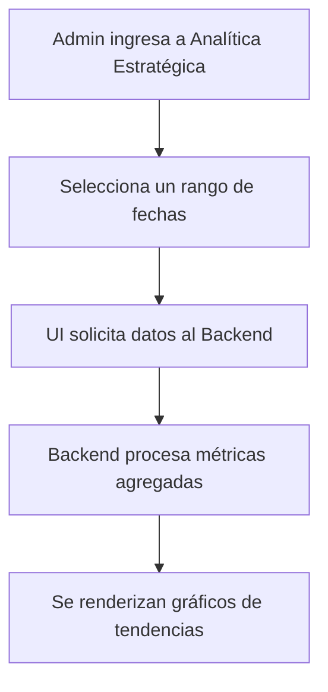

## 🧭 Visión General del Módulo

Ubicado dentro del menú de Gestión, este componente proporciona a los administradores y organizadores una vista panorámica del rendimiento del hub. Permite analizar el crecimiento de usuarios, la retención en eventos, y los flujos financieros generados por las inscripciones a lo largo del tiempo.

:::security Permisos Requeridos
- **Roles Autorizados:** ORGANIZADOR, ADMIN
- **Scopes Técnicos:** `events.manage` (o permisos de analítica específicos)
:::

## 🖥️ Interfaz de Usuario (UI) y Elementos Visuales

La vista está dominada por componentes de visualización de datos (como gráficos de barras, de líneas y tortas), construidos con bibliotecas compatibles con Fluent UI. Ofrece filtros de rango de fechas y segmentación de datos.

## 🔄 Flujo de Trabajo Estándar (Paso a Paso)

1. **Acción 1:** El administrador selecciona el periodo de evaluación (ej. "Últimos 30 días" o un mes específico).
2. **Acción 2:** El sistema computa los datos de registros, asistencia real vs esperada, e ingresos financieros.
3. **Acción 3:** El usuario puede exportar estos reportes consolidados (usualmente en formato CSV).

:::tip Buenas Prácticas
Utiliza los filtros cruzados (ej. tipo de evento vs asistencia) para identificar qué temáticas generan mayor interés en la comunidad y optimizar así la planeación del siguiente trimestre.
:::

## 🛠️ Lógica de Control de Excepciones (Manejo de Errores)

* **¿Qué pasa si una consulta de datos toma mucho tiempo?** Dado que las agregaciones pueden ser pesadas, la interfaz implementa indicadores de progreso circulares (Spinners). Si supera el tiempo de espera predefinido (Timeout), alertará para intentar consultar un rango de fechas más corto.
