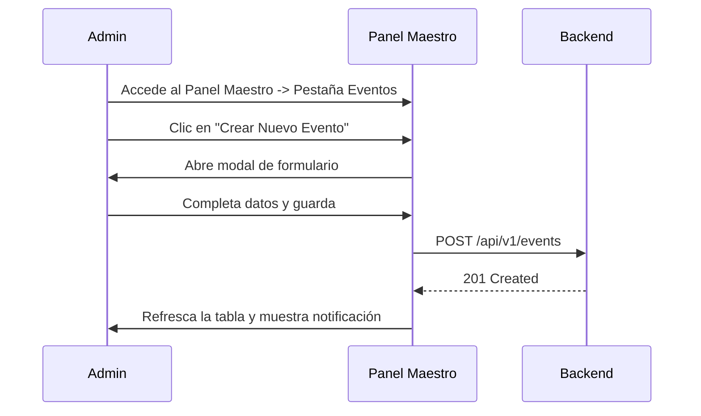

## 🧭 Visión General del Módulo

El "Panel Maestro" es el centro operativo (Backend Interface) desde donde los administradores y organizadores crean, editan y eliminan eventos, gestionan el inventario de recursos (Souvenirs/Librería), configuran insignias y administran toda la lógica del ecosistema MEH.

:::security Permisos Requeridos
- **Roles Autorizados:** ADMIN, ORGANIZADOR
- **Scopes Técnicos:** `events.manage`, `admin.access`
:::

## 🖥️ Interfaz de Usuario (UI) y Elementos Visuales

La pantalla está subdividida mediante pestañas (`Tabs` de Fluent UI) que organizan las diferentes áreas de control: Eventos, Academia, Librería, Usuarios, etc. Contiene tablas de datos de alta densidad con opciones de filtrado y modales flotantes (Drawers) para la edición de registros complejos.

## 🔄 Flujo de Trabajo Estándar (Paso a Paso)

1. **Acción 1:** El administrador entra al Panel Maestro y selecciona la pestaña correspondiente (ej. Eventos).
2. **Acción 2:** Interactúa con los botones de acción (`Create`, `Edit`, `Delete`) para un registro específico.
3. **Acción 3:** Confirma los cambios mediante los diálogos de seguridad y el sistema actualiza la base de datos central.

:::tip Buenas Prácticas
Al crear un evento, asegúrate de configurar correctamente los *Tiers* (paquetes de precios) y capacidades máximas. Una vez un evento se publica y recibe inscripciones, ciertos campos como el precio no deberían modificarse para evitar inconsistencias.
:::

## 🛠️ Lógica de Control de Excepciones (Manejo de Errores)

* **¿Qué pasa si intento eliminar un recurso en uso?** Si intentas eliminar una "Insignia" que ya ha sido otorgada a varios usuarios, la base de datos emitirá una restricción referencial. El panel atrapará este error y te mostrará un mensaje descriptivo ("No se puede eliminar porque está en uso. Considera desactivarla").
