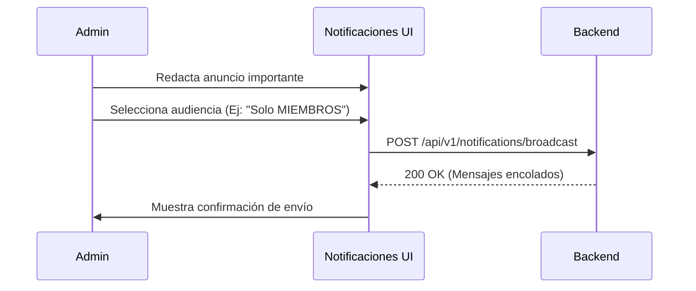

## 🧭 Visión General del Módulo

El módulo de "Notificaciones" dentro del área de Gestión permite a los administradores componer, programar y enviar comunicados globales o segmentados (Push, Email, Avisos en Tablero) a toda la base de usuarios de la plataforma MEH o a grupos específicos de interés.

:::security Permisos Requeridos
- **Roles Autorizados:** ADMIN, ORGANIZADOR
- **Scopes Técnicos:** `events.manage` (o equivalente de comunicaciones)
:::

## 🖥️ Interfaz de Usuario (UI) y Elementos Visuales

Consiste en un formulario tipo "Compositor de Mensajes" (WYSIWYG editor) y un historial de envíos recientes. Incluye opciones para establecer el canal de distribución, el título, el cuerpo del mensaje y el público objetivo (ej. "Todos los usuarios", "Solo inscritos a evento X").

## 🔄 Flujo de Trabajo Estándar (Paso a Paso)

1. **Acción 1:** El administrador entra a la vista de Notificaciones.
2. **Acción 2:** Escribe el comunicado en el editor, definiendo nivel de urgencia e insertando enlaces si es necesario.
3. **Acción 3:** Presiona "Enviar". El sistema distribuye el mensaje a los tableros de cada usuario destino.

:::tip Buenas Prácticas
Utiliza las notificaciones globales solo para anuncios críticos (cambios de horarios en eventos mayores, paradas por mantenimiento). El abuso de las notificaciones puede generar "fatiga de alertas" en la comunidad.
:::

## 🛠️ Lógica de Control de Excepciones (Manejo de Errores)

* **¿Qué pasa si ocurre un error de red al enviar?** Si la petición falla, el editor conservará el borrador del mensaje que estabas escribiendo, evitando que pierdas tu trabajo, y mostrará un botón para "Reintentar envío".
