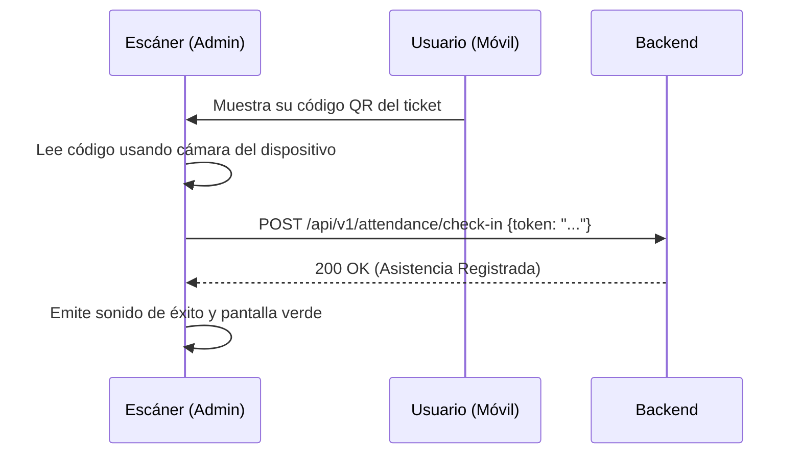

## 🧭 Visión General del Módulo

Esta herramienta es crucial para la logística en sitio (On-site) durante los eventos presenciales. Transforma cualquier dispositivo móvil o computadora con cámara en un escáner de tickets que valida la autenticidad de la entrada y registra la asistencia del participante en tiempo real.

:::security Permisos Requeridos
- **Roles Autorizados:** MODERADOR, ORGANIZADOR, ADMIN
- **Scopes Técnicos:** `attendance.scan`
:::

## 🖥️ Interfaz de Usuario (UI) y Elementos Visuales

La interfaz es minimalista y optimizada para uso en móviles. En el centro, renderiza el visor de la cámara web (usando librerías como `html5-qrcode`). En la parte inferior, muestra una consola de retroalimentación inmediata (Verde = Válido, Rojo = Inválido/Ya escaneado).

## 🔄 Flujo de Trabajo Estándar (Paso a Paso)

1. **Acción 1:** El organizador abre la vista de "Escaneo QR" y permite el acceso a su cámara.
2. **Acción 2:** Escanea la pantalla del celular del asistente (o su ticket impreso).
3. **Acción 3:** El sistema valida contra la base de datos de manera casi instantánea y refleja el "Check-in".

:::tip Buenas Prácticas
Asegúrate de contar con una buena iluminación en la zona de registro y una conexión a internet estable. Para eventos masivos, se recomienda tener varios organizadores usando la herramienta en paralelo.
:::

## 🛠️ Lógica de Control de Excepciones (Manejo de Errores)

* **¿Qué pasa si el ticket ya fue escaneado?** La UI reaccionará de forma clara, mostrando una pantalla roja, un sonido de alerta de error y el mensaje: "Ticket ya utilizado. Check-in registrado anteriormente el [Fecha/Hora]". Esto previene fraudes en el acceso.
