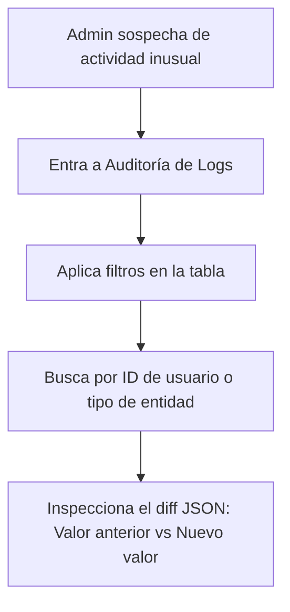

## 🧭 Visión General del Módulo

Ubicado en el menú de "Sistema", este es el panel de control maestro para el seguimiento y la trazabilidad. Registra cada acción crítica (creación, edición, eliminación o fallos de seguridad) realizada por cualquier usuario dentro de la plataforma, garantizando la transparencia operativa.

:::security Permisos Requeridos
- **Roles Autorizados:** ADMIN
- **Scopes Técnicos:** `audit.read`
:::

## 🖥️ Interfaz de Usuario (UI) y Elementos Visuales

Consiste en una inmensa tabla de registros de datos tipo consola. Cada fila detalla el Timestamp, el ID del autor de la acción, la entidad afectada (ej. `usuarios`, `eventos`), la operación realizada (`UPDATE`, `DELETE`) y el payload de cambios en formato JSON.

## 🔄 Flujo de Trabajo Estándar (Paso a Paso)

1. **Acción 1:** El Administrador accede a la sección de Auditoría para investigar un cambio reciente no esperado.
2. **Acción 2:** Filtra la tabla por fecha o por el nombre de la tabla de la base de datos (ej. `tabla_pagos`).
3. **Acción 3:** Despliega el detalle del registro para comparar exactamente qué campo fue alterado y quién ejecutó la acción.

:::tip Buenas Prácticas
Utiliza esta herramienta siempre que necesites resolver disputas. Si un usuario alega que "sus puntos desaparecieron", el log de auditoría tendrá el registro exacto, minuto a minuto, de cómo se calculó y modificó esa métrica.
:::

## 🛠️ Lógica de Control de Excepciones (Manejo de Errores)

* **¿Qué pasa si el log es demasiado grande para cargar?** La interfaz implementa paginación forzada del lado del servidor (Server-Side Pagination). Solo se cargarán lotes de 50 o 100 registros a la vez, garantizando que el navegador del administrador no se congele (Crash).
