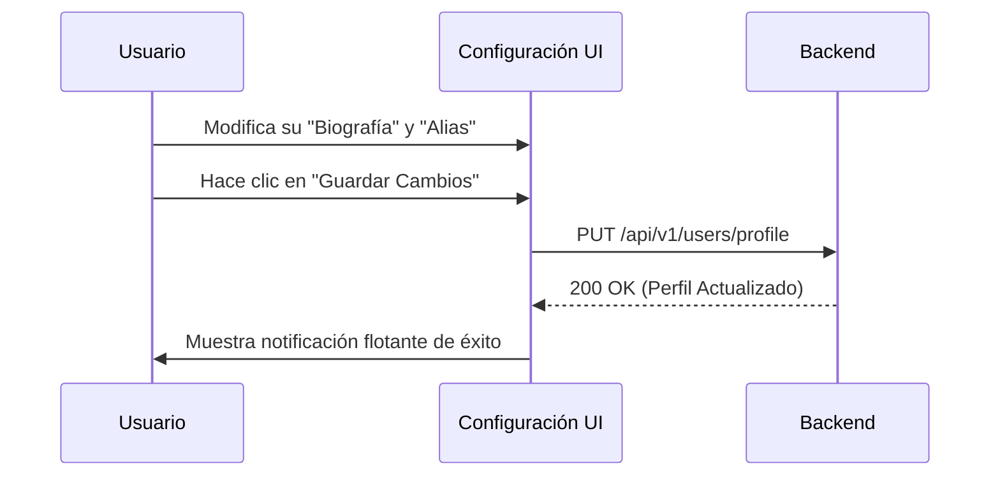

## 🧭 Visión General del Módulo

El módulo de "Configuración" es el espacio dedicado a la gestión y personalización técnica del perfil de usuario. Aquí se pueden ajustar preferencias del sistema (como el idioma y el tema visual), modificar datos sensibles (como la contraseña y el correo), y actualizar la información pública del perfil, incluyendo el Alias y la Biografía.

:::security Permisos Requeridos
- **Roles Autorizados:** TODOS (Acceso universal para usuarios autenticados)
- **Scopes Técnicos:** `profile.update`, `auth.update`
:::

## 🖥️ Interfaz de Usuario (UI) y Elementos Visuales

La interfaz se divide en secciones claras utilizando componentes de tarjetas (`Cards`) y formularios (`Forms`) de Fluent UI. Incluye campos de texto, selectores desplegables para el idioma, interruptores (Switches) para el tema Oscuro/Claro, y botones de acción primaria para guardar los cambios o cambiar la contraseña.

## 🔄 Flujo de Trabajo Estándar (Paso a Paso)

1. **Acción 1:** El usuario accede a "Configuración" desde el menú lateral inferior.
2. **Acción 2:** Modifica las opciones deseadas (ej. Cambia el tema a Oscuro). El cambio de tema se aplica instantáneamente en el Frontend.
3. **Acción 3:** Si modifica datos del perfil (Nombres, Alias), presiona "Guardar" para que los cambios persistan en el Backend.

:::tip Buenas Prácticas
Mantén tu información de contacto actualizada, especialmente tu correo electrónico, ya que es el medio principal para recibir notificaciones importantes, certificados y enlaces de recuperación de contraseña.
:::

## 🛠️ Lógica de Control de Excepciones (Manejo de Errores)

* **¿Qué pasa si intento cambiar mi contraseña a una muy débil?** El formulario valida en tiempo real la robustez de la contraseña. Si no cumple con los requisitos (longitud, caracteres especiales), el botón de "Actualizar Contraseña" permanecerá bloqueado y se mostrará un mensaje de advertencia bajo el campo de texto.
